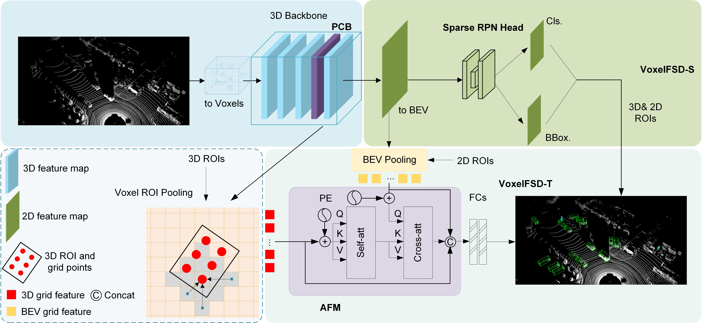

# VoxelFSD

This repository is the official code of the paper "VoxelFSD: voxel-based fully sparse detector for 3D object detection", VoxelFSD is a voxel-based fully sparse detector, the workflow is shown in Fig. 1, which has significant real-time performance on large-scale point clouds compared with the previous ones. VoxelFSD is a voxel-based fully sparse detector for 3D object detection, its flow is shown in Fig. 1, compared with the previous semi-dense structure of the detector in the large-scale point cloud in real time, see Fig. 2, and to ensure real-time at the same time has a superior performance, see Table 1.

## Installation
* download the KITTI dataset from [here](https://www.cvlibs.net/datasets/kitti/eval_object.php?obj_benchmark=3d)
